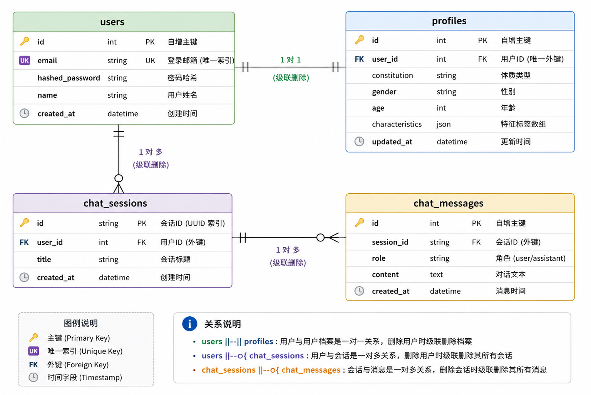
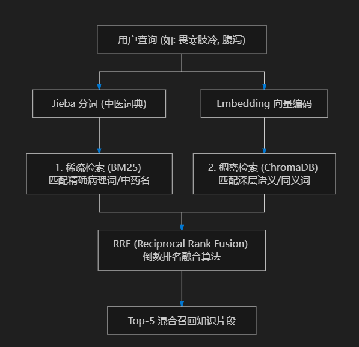
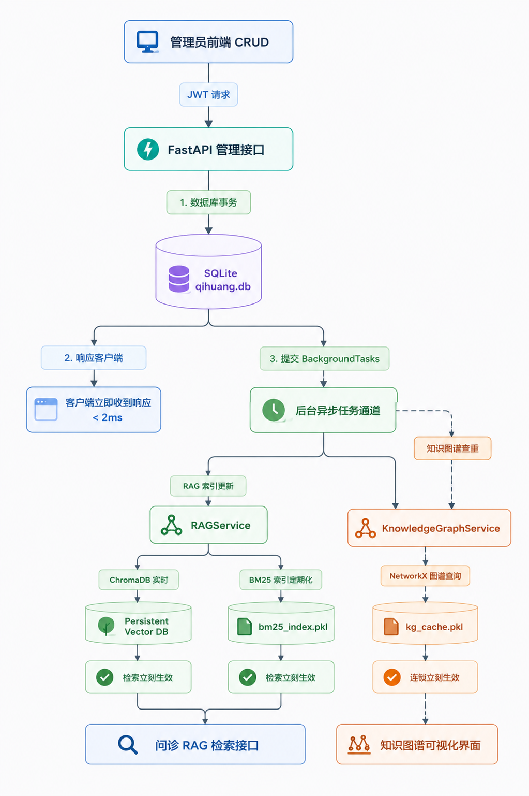

# 岐黄 AI — 中医智能问诊助手 (RAG & 知识图谱)

«岐黄 AI» 是一款融合了**知识检索增强生成（RAG）**与**知识图谱（Knowledge Graph）**的中医智能问诊与本草/方剂百科系统。平台理论深度结合中医**经方派**（如《伤寒论》《金匮要略》）与**温病派**（如《温病条辨》）思想，为用户提供科学、严谨的体质评估与辨证调理建议。

---

## 🌟 核心特性

1. **AI 智能问诊 (双路召回与融合推理)**：
   * **稀疏检索 (BM25)**：通过定制的**中医分词词典 (Jieba)** 进行关键词级别的高效召回。
   * **稠密检索 (Vector Search)**：基于本地部署的 `BAAI/bge-small-zh-v1.5` 向量模型进行深层语义搜索，数据持久化保存在 **ChromaDB**。
   * **倒数排名融合 (RRF)**：综合双路检索优势对文档进行排序，产出最高质量的中医知识背景。
2. **中医知识图谱可视化**：
   * 基于 **NetworkX** 构建轻量化、高性能的内存图谱。
   * 支持中药、方剂、证型、归经、症状等多维度实体与关系（如 `CONTAINS`, `TREATS_SYMPTOM`, `HAS_SYMPTOM` 等）。
   * 前端使用 SVG 进行高交互性的引力场图谱渲染，支持缩放、拖拽与高亮高显。
3. **数据热更新与异步索引**：
   * 管理员可通过后台对本草和方剂进行实时增删改。
   * 系统通过 **FastAPI 后台任务** 异步触发向量数据库重算与内存图谱重建，确保前台检索无感知、低延迟。
4. **健康画像与体质测试**：
   * 提供多维度问答测试，动态计算用户的阴、阳、气、血、精、神五行偏颇。
   * 系统根据用户的体质特征与当前时令，自动生成个性化的药膳与养生推荐。

---

## 📐 系统架构与设计

### 1. 数据库结构设计
系统基于 SQLite 数据库，并使用 WAL 模式提供高并发读写性能。


### 2. RAG 双路召回检索架构
融合稀疏与稠密检索的倒数排名融合（RRF）机制。


### 3. 数据热更新与异步重建流程
保证高吞吐、低延迟的用户数据操作体验。


---

## 📂 项目目录结构

```
qihuang-ai/
  backend/            # 后端服务
    app/
      core/           # 核心配置（数据库连接、JWT鉴权、全局路径配置）
      models.py       # SQLAlchemy 数据库模型
      schemas.py      # Pydantic 数据验证与序列化模型
      background/     # 异步后台索引更新任务
      services/       # 核心业务层（RAG 检索、知识图谱推理）
      routers/        # API 接口路由（鉴权、问诊、百科、图谱、管理员后台）
    data/             # 运行时数据（数据库文件、ChromaDB、分词词典、索引缓存）[已忽略不提交]
    scripts/          # 工具脚本（种子数据填充、RAG 向量索引生成）
    main.py           # 后端服务入口
  document/           # 架构设计与文档配图
  src/                # 前端服务 (React + Vite)
    components/       # 通用组件 (导航栏等)
    pages/            # 路由页面 (问诊、百科、图谱、体质画像等)
    services/         # API 请求接口封装
    App.jsx           # 全局路由与权限上下文
    index.css         # 全局样式主题设计
```

---

## 🚀 快速启动指南

建议的开发环境：**Node.js 18+** / **Python 3.10+** (推荐使用 Conda 虚拟环境)。

### 1. 后端环境配置与运行

#### 步骤一：安装 Python 依赖包
进入 `backend` 目录，安装运行所需的第三方库：
```bash
cd backend
pip install fastapi uvicorn sqlalchemy pydantic bcrypt pyjwt rank-bm25 sentence-transformers networkx chromadb modelscope jieba
```

#### 步骤二：配置文件准备
在项目根目录 `qihuang-ai/` 下，新建或修改 `.env` 配置文件以配置云存储服务（阿里云 OSS 用于药材/方剂插图）：
```ini
# 阿里云OSS配置
OSS_ACCESS_KEY_ID=您的AccessKey_ID
OSS_ACCESS_KEY_SECRET=您的AccessKey_Secret
OSS_BUCKET=qihuang-ai
OSS_REGION=oss-cn-beijing
```

#### 步骤三：初始化数据库与种子数据
运行种子数据脚本，自动生成 SQLite 数据库文件并填充 50 味中药、50 首经典方剂及默认超级管理员账号：
```bash
python scripts/seed_data.py
```

#### 步骤四：构建 RAG 向量与稀疏索引
运行建库脚本，该脚本会自动使用 BGE 向量模型为全量中药和方剂生成 Embedding，并持久化到 ChromaDB 和本地 pickle 缓存：
```bash
python scripts/index_data.py
```
*(注：首次运行时会自动从 ModelScope 镜像源下载模型，耗时取决于网速，后续启动为本地秒级加载。)*

#### 步骤五：启动后端 API 服务
使用 `uvicorn` 运行 FastAPI 应用：
```bash
python -m uvicorn main:app --reload --port 8000
```
运行成功后可访问健康检查接口：[http://localhost:8000/api/health](http://localhost:8000/api/health)，或访问 Swagger 交互式文档接口：[http://localhost:8000/docs](http://localhost:8000/docs)。

---

### 2. 前端环境配置与运行

#### 步骤一：安装 Node 依赖
在项目根目录运行以下命令安装前端库：
```bash
npm install
```

#### 步骤二：运行前端开发服务器
```bash
npm run dev
```
启动成功后，打开浏览器访问本地开发地址即可：[http://localhost:5173/](http://localhost:5173/)。

---

## 🔑 系统登录账户

系统内置了超级管理员账户供测试与后台管理：

* **超级管理员账号**（可进入后台进行本草与方剂的增删改）：
  * 邮箱：`admin@qihuang.com`
  * 密码：`admin123`

普通用户请在登录页面切换至 **“注册”** 选项创建个人账号，注册成功后即可登录使用系统。

---

## ⚕️ 免责声明
本平台仅用于中医信息化及 RAG & 知识图谱的技术学习与演示交流，不构成任何形式的医疗建议。如有真实医疗需求，请务必前往正规医院诊治。
